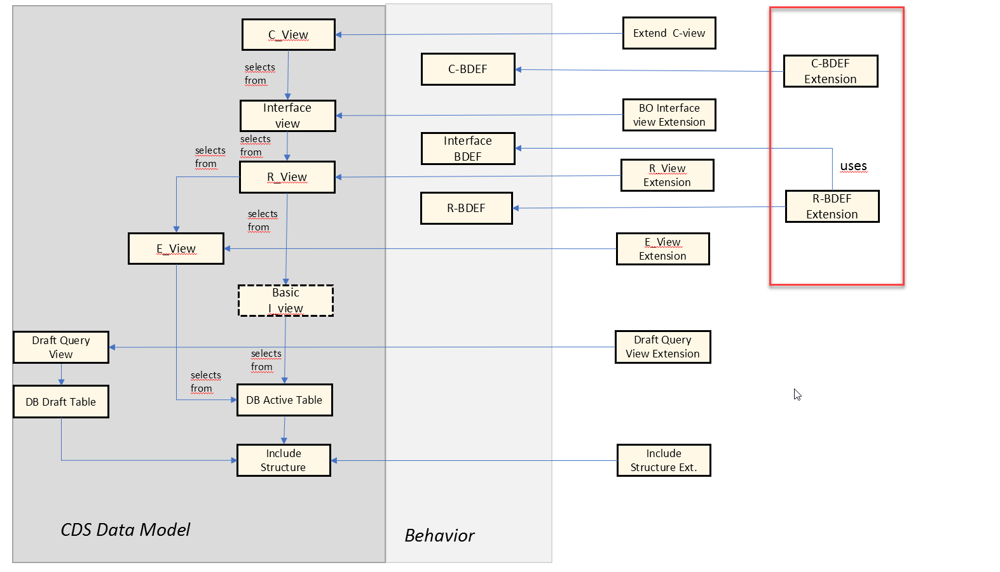
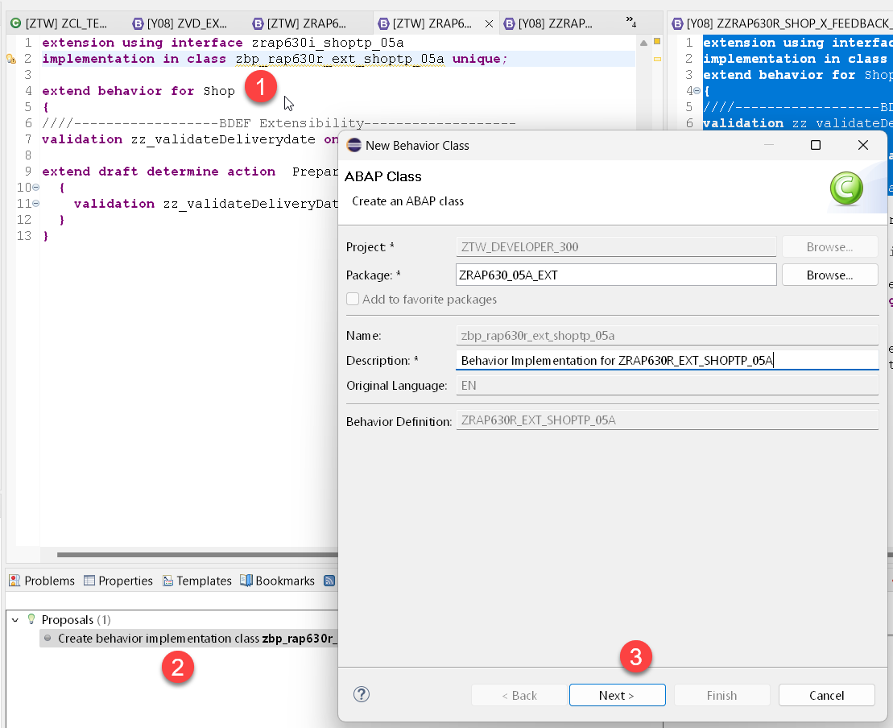
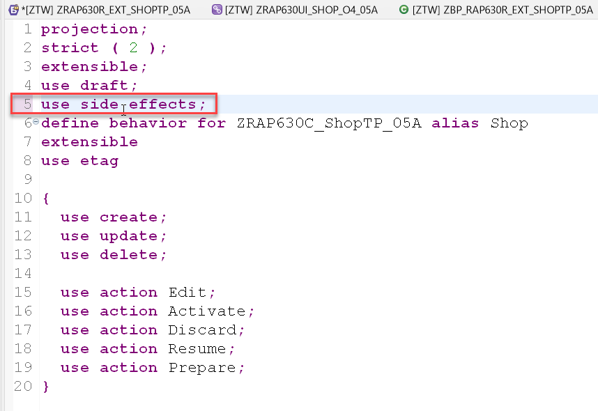

# Exercise 2 - Behavior extension

In this exercise, we will extend the behavior of an extensible RAP BO. That means we will add a validation, a determination and side-effects to the behavior of the RAP BO by using an extenstion.   

Since extending a RAP BO in parallel by several developers can cause severe problems every participant will work with his or her own base RAP BO. For your convenience an extensible RAP BO has thus been generated using the class `zdmo_gen_rap630_single` that you have run in the [Getting started](../ex0/README.md) section.  

## Exercise 2.1 Extend the behavior definition with a validation

>  After completing these steps you will have created a validation to check the delivery date.  

 

  
🔵 Click to expand!

1. Right-click on the behavior definition `ZRAP630R_ShopTP_###` and select **New Behavior Extension** from the context menue. 

      

2. In the Create Behavior Extension dialogue enter the following values

    > **⚠⚠⚠ Caution**     
    > Be sure to change the name of the package from `ZRAP630_###` to `ZRAP630_###_EXT`.
    > By default the dialogue will propose the package name of the base RAP BO.  
    > In case of a package delivered by SAP this won't be a problem, but here we want to build the extension in a different package
    > in the customer namespace `Z`.
    
    **Package**: ⚠`ZRAP630_###_EXT`⚠   
    **Name**: `ZRAP630R_EXT_SHOPTP_###`  
    **Description**: `Extension for ZRAP630R_ShopTP_###`    
    **Behavior Definition**: `ZRAP630R_SHOPTP_###`  
    **BO Interface**: `ZRAP630I_SHOPTP_###`  

       

3. Select a transport request and press **Finish**   <  

4. Add a validation `zz_validateDeliverydate` to your behavior defintion that reacts on `create;` and the field `DeliveryDate;`  
   This validation must also be added to the `draft determine action Prepare` and activate your changes.
 
   <pre>
   extension using interface zrap630i_shoptp_05c
   implementation in class zbp_zrap630r_shop_x_fbk_05c unique;

   extend behavior for Shop
   {     
     validation zz_validateDeliverydate on save { create;   field DeliveryDate; }

     extend draft determine action  Prepare
     {
       validation zz_validateDeliveryDate;
     }
   }  
   </pre> 

   
5. Click on the proposed name of the behavior implementation class **(1)** of your behavior extension and press **Ctrl+1** to start the content assist and click on the proposed action **(2)** and press Next **(3)**.  
   
    
   
6. Select a transport request and press **Finish**.    
   
7. This will open the editor for your behavior implementation class. Here you have to have to navigate to the **Local Types** tab since the implementation of behaviors takes place in local classes.    

       

8. Add the following code to the 

<pre>   
CLASS lhc_shop DEFINITION INHERITING FROM cl_abap_behavior_handler.   

  PUBLIC SECTION.  
    CONSTANTS state_area_check_delivery_date       TYPE string VALUE 'CHECK_DELIVERYDATE'       ##NO_TEXT.   
  PRIVATE SECTION.  
    METHODS zz_validateDeliverydate               FOR VALIDATE ON SAVE  
      IMPORTING keys FOR Shop~zz_validateDeliverydate.  

ENDCLASS.  

CLASS lhc_shop IMPLEMENTATION.  

  METHOD zz_validateDeliverydate.  
    READ ENTITIES OF ZRAP630i_ShopTP_### IN LOCAL MODE  
            ENTITY Shop  
            FIELDS ( DeliveryDate OverallStatus )  
            WITH CORRESPONDING #( keys )  
            RESULT DATA(onlineorders).  

    LOOP AT onlineorders INTO DATA(onlineorder).  
      APPEND VALUE #( %tky           = onlineorder-%tky  
                      %state_area    = state_area_check_delivery_date )  
             TO reported-shop.  
      DATA(deliverydate)             =  onlineorder-DeliveryDate - cl_abap_context_info=>get_system_date(  ).  
      IF onlineorder-deliverydate IS INITIAL  .  
        APPEND VALUE #( %tky           = onlineorder-%tky ) TO failed-shop.  
        APPEND VALUE #( %tky           = onlineorder-%tky  
                        %state_area    = state_area_check_delivery_date  
                        %msg           = new_message_with_text(  
                                            severity = if_abap_behv_message=>severity-error  
                                            text     = 'delivery period cannot be initial'  
                       ) )  
                TO reported-shop.  
      ENDIF.  
    ENDLOOP.  
  ENDMETHOD.  
ENDCLASS.  

</pre>  

9. Open the service binding `ZRAP630UI_SHOP_O4_###` of your RAP base BO.

10. Double-click on the entity **Shop** . This will start the ADT preview of the Shop RAP BO.  

     

10. Press the **Create** button.   
11. Select an order item but do not select a **Delivery Date** 
12. This shall raise the follwoing error message:   

       

## Exercise 2.2 Extend the behavior definition with an determination

In a second step we will now add a determination `ZZ_setOverallStatus` to the behavior defintion extension. This shall be executed in case the content of the field `OrderedItem` is changed by the user.   

 

  
🔵 Click to expand!

 
1. Add the following statement to your behavior defintion extension `ZRAP630R_EXT_SHOPTP_###`.     

   <pre>
     determination ZZ_setOverallStatus on modify {  field OrderedItem; }
   </pre>
  
  so that the code of your BDEF should now read as follows:   
  <pre>   
  extension using interface zrap630i_shoptp_###
    implementation in class zbp_rap630r_ext_shoptp_### unique;

  extend behavior for Shop
  {
    validation zz_validateDeliverydate on save { create; field DeliveryDate; }

    extend draft determine action Prepare
     {
       validation zz_validateDeliveryDate;
      }
    determination ZZ_setOverallStatus on modify { field OrderedItem; }
   }
  </pre>

2. Press **Ctrl+1** to start the content assist and double-click on the proposal to add the appropriate code in the behavior implementation class `zbp_rap630r_ext_shoptp_###`. 

3. Add the following code into the implementation of the method `ZZ_setOverallStatus`.
   
   > The code first performs a read request using EML using the key fields of our RAP BO that are provided by the framework an reads the data of all affected 
   > orders. In the following loop statement it is checked whether the price exceeds a certain threshould (1000 EUR) and depending on the price the order is 
   > either autmatically approved or is awaiting an approval.   
   > The price for a product is read from an CDS view and the instance of the RAP BO is modified accordingly.    
 
   <pre>
   METHOD ZZ_setOverallStatus.

    DATA update_bo      TYPE TABLE FOR UPDATE     ZRAP630i_ShopTP_###\\Shop.
    DATA update_bo_line TYPE STRUCTURE FOR UPDATE ZRAP630i_ShopTP_###\\Shop .

    READ ENTITIES OF ZRAP630I_ShopTP_### IN LOCAL MODE
      ENTITY Shop
        ALL FIELDS " ( OrderItemPrice OrderID )
        WITH CORRESPONDING #( keys )
      RESULT DATA(OnlineOrders)
      FAILED DATA(onlineorders_failed)
      REPORTED DATA(onlineorders_reported).

    DATA(product_value_help) = NEW zrap630_cl_vh_product_###(  ).
    data(products) = product_value_help->get_products(  ).

    LOOP AT onlineorders INTO DATA(onlineorder).

      update_bo_line-%tky = onlineorder-%tky.

      IF onlineorder-OrderItemPrice > 1000.
        update_bo_line-OverallStatus = 'Awaiting approval'.
      ELSE.
        update_bo_line-OverallStatus = 'Automatically approved'.
      ENDIF.

      SELECT SINGLE * FROM @products as hugo
         WHERE Product = @onlineorder-OrderedItem  INTO @data(product).

      update_bo_line-OrderItemPrice = product-Price.
      update_bo_line-CurrencyCode = product-Currency.

      APPEND update_bo_line TO update_bo.
    ENDLOOP.

    MODIFY ENTITIES OF zrap630i_shoptp_### IN LOCAL MODE
      ENTITY Shop
        UPDATE FIELDS (
        OverallStatus
        CurrencyCode
        OrderItemPrice
        )
        WITH update_bo
       REPORTED DATA(update_reported).

    reported = CORRESPONDING #( DEEP update_reported ).

  ENDMETHOD.
   
   </pre>

3. > When you get the error message:   
   > The entity "SHOP" does not have a determination "ZZ_SETOVERALLSTATUS".	 
   > This might be, because you have not activated yor BDEF yet.   

> You will notice that the data is updated, but the changes in the data (the price) are not automatically reflected there. 
> This we will change in the following step of our excerise.

## Exercise 2.3 Extend the behavior with side effects

In this exercise we will show how side effect can be added to an extensible base RAP business object by using a BDEF Extension.

### ⚠⚠⚠ Caution - Perform a fix in the behavior projection of the RAP base BO 

> Before starting the exercise we have to fix a missing feature in generated code. 
> Since it is not yet possible to generate a `use side effects;` in the projection BDEF 
> we have to add the same manually before starting to extend the base BO with side effects.

  
🔵 Click to expand!

 
1. Open the generated projection Behavior defintion `ZRAP630C_ShopTP_###` of the base BO. Here we have to add the statement `use side effects;`. 
   This statement has to be added to the base business object is because the statement cannot be added by the extension 
   but has to be part of the base business object.  
 
   <pre>
     use side effects;
   </pre>   

2. The code of the generated projection behavior definition should now read as follows.    

<pre>
projection;
strict ( 2 );
extensible;
use draft;
use side effects;
define behavior for ZRAP630C_ShopTP_### alias Shop
extensible
use etag

{
  use create;
  use update;
  use delete;

  use action Edit;
  use action Activate;
  use action Discard;
  use action Resume;
  use action Prepare;
}   
</pre>

When you now try out the extended RAP business object you should notice that the price is still not automatically updated once the user has selected a new object.
 

 
Now you can continue and add side effects via your behavior defintion extension ...

  
🔵 Click to expand!

1. Open the behavior extension `ZRAP630R_Ext_ShopTP_###` by pressing **Ctrl+Shift+A**.
2. Add the following code snippet  
   
   <pre>side effects { field OrderedItem affects field OrderItemPrice , field CurrencyCode ; }</pre>  

   to your behavior extension right after the determination. 
 
   Your BDEF extension code should now read as follows:  

  <pre>
    extension using interface zrap630i_shoptp_###
      implementation in class zbp_rap630r_ext_shoptp_### unique;

      extend behavior for Shop
   {
     validation zz_validateDeliverydate on save { create; field DeliveryDate; }
     extend draft determine action Prepare
     {
       validation zz_validateDeliveryDate;
      }
    determination ZZ_setOverallStatus on modify { field OrderedItem; }
    side effects { field OrderedItem affects field OrderItemPrice , field CurrencyCode ; }
    }
   </pre>

3. Create a new order, specify a delivery data or open an existing order and switch to the edit mode and then select a (new) product. 
   
   You will notice that the data that you have selected in the SAP Fiori UI is now being updated automatically when chaning / selecting a new product.

   
 
</pre> 
 

## Summary

You've now extended the behavior of the base RAP business object. For this you only had to create an extension of the BDEF of the base BO on the R-layer.

Continue to - [Exercise 3 - Extend the data model ](../ex3/README.md)

